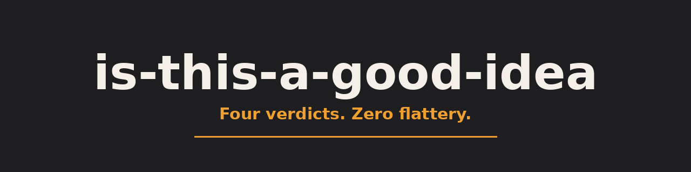
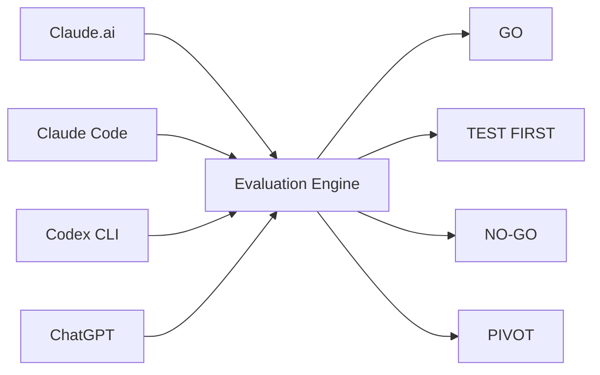
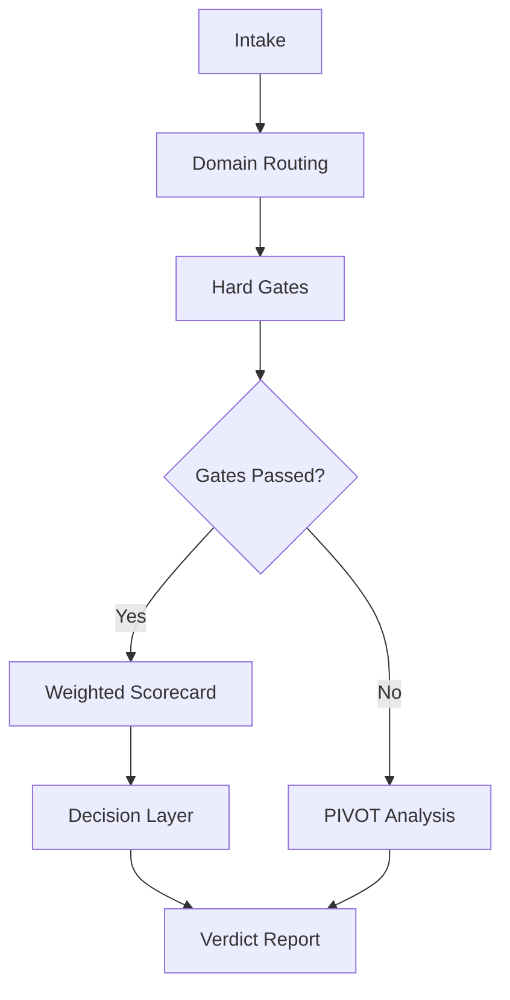

<div align="center">
  
</div>

<div align="center">


</div>

# is-this-a-good-idea

A domain-routed idea evaluation skill. It routes your idea to one of four domains (business, real estate, market-facing app, internal workflow tool), kills fatally flawed ideas at hard gates before they ever reach a score, ranks the survivors on five weighted dimensions, and issues exactly one of four verdicts: GO, TEST FIRST, NO-GO, or PIVOT. Every claim in the report carries an evidence tag, so you can see which parts are verified, which came from you, and which the skill assumed.

```
.----------------------------------------------------------.
|                                                          |
|   i s - t h i s - a - g o o d - i d e a        v1.0.0    |
|                                                          |
|   Four verdicts. Zero flattery.                          |
|   GO  |  TEST FIRST  |  NO-GO  |  PIVOT                  |
|                                                          |
'----------------------------------------------------------'
```

## What It Does

The evaluation runs in three layers, in order:

1. **Hard gates.** Pass/fail kill switches specific to the routed domain. A business idea with no path to a first paid dollar and no behavioral evidence of spend fails here. A deal that cannot clear a 1.2 DSCR fails here. Failing a gate stops the run and sends the idea to PIVOT analysis. It never reaches a score.
2. **Weighted scorecard.** Survivors are scored 1 to 5 on five dimensions with plain-language anchors, weighted by domain. A business idea weights demand evidence at 30 percent. A real estate deal weights deal economics at 35 percent. Every score gets a one-line or two-line justification.
3. **Decision layer.** Munger's inversion (what would have to be true for this to fail), Klein's pre-mortem, expected-value tie-breaks when two options are close, and Amazon's Working Backwards press-release test. This is what converts a number into a verdict.



Invoke it by naming it. It never auto-triggers.

```
/is-this-a-good-idea duplex at $310k, rents $2,600 combined, 25% down
```

```
Use the is-this-a-good-idea skill: an AI tool that drafts contractor SOWs from voice notes
```

## Example Output

```text
VERDICT: TEST FIRST
Opportunity cost: 3 weeks and roughly $2k of build time that could
otherwise go to the lease-abstract tool, which already has two buyers.

HARD GATES
  E-G1  Velocity to first dollar ....... PASS  Manual SOW drafting for
        one paying contractor is billable inside 30 days. [USER-SUPPLIED]
  E-G2  Behavioral evidence ............ PASS  You already draft these by
        hand and get paid for them. Past behavior, not opinion. [VERIFIED]

SCORECARD (Domain E)
  Dimension                    Weight   Score
  Demand evidence quality        30%      3    One buyer, not a market
  Unit economics plausibility    25%      4    Margin holds if usage is low
  Speed to first dollar          20%      5    Billable now, manually
  Effort and operator fit        15%      4    In your existing skill set
  Differentiation                10%      2    A competent copycat wins
  Weighted average ............ 3.55

MOST FATAL UNTESTED ASSUMPTION
  That contractors outside your own network will pay for drafted SOWs.
  One paying customer who is also your colleague is not demand. [ASSUMED]

NEXT ACTIONS
  1. Today: charge three contractors outside your network $150 each for a
     hand-drafted SOW from a voice note. No build. See who pays.
  2. If two of three pay, build the thinnest version that automates only
     the drafting step. If none pay, the idea is NO-GO, not TEST FIRST.
```

## How It Works

Gates run before scores, and that ordering is the whole point. A weighted average is a persuasive-looking number, and a fatally flawed idea can still produce a respectable one if you let it into the scorecard. So it does not get in. A failed gate routes straight to PIVOT analysis, which looks for a salvageable core rather than a total number.

Verdict mapping for the ideas that clear the gates:

| Verdict | Condition |
|---|---|
| **GO** | Weighted score 4.0 or higher, no cap triggered. Proceed. |
| **TEST FIRST** | Weighted score 3.0 to 3.99, or a cap was triggered (for example, a real estate deal with exactly one viable exit). The report names the fatal assumption and the cheapest test that would falsify it. |
| **PIVOT** | The idea as framed fails, but a salvageable core exists. The report names the core and the new angle. |
| **NO-GO** | Weak across the board, nothing worth saving. The report states the kill reason in one line. |



## Install

### Claude.ai (Chat)

Upload `SKILL.md` to a conversation or attach it to a Project. Invoke with:

```
Use the is-this-a-good-idea skill: [your idea]
```

### Claude Code

```bash
mkdir -p ~/.claude/skills/is-this-a-good-idea
cp SKILL.md ~/.claude/skills/is-this-a-good-idea/
mkdir -p ~/.claude/commands
cp claude-code/is-this-a-good-idea.md ~/.claude/commands/
```

Invoke with:

```
/is-this-a-good-idea a SaaS that auto-generates lease abstracts for landlords
```

### Codex CLI

```bash
mkdir -p ~/.codex/skills/is-this-a-good-idea
cp SKILL.md ~/.codex/skills/is-this-a-good-idea/
```

Then reference the skill by name in your session.

### ChatGPT

Open `chatgpt/instructions.md`, copy everything below the divider line, and paste it into the Instructions field of a Custom GPT (or a project's custom instructions). This is a flattened single-document version of the same logic, compressed to fit ChatGPT's instruction character limit.

## Usage Examples

```
/is-this-a-good-idea duplex in a B-class neighborhood, $310k, rents $2,600 combined, 25% down at current rates

Use the is-this-a-good-idea skill: an AI tool that drafts contractor scope-of-work docs from voice notes

/is-this-a-good-idea internal automation that pulls rent rolls from email attachments into a spreadsheet every Monday
```

## File Structure

```
is-this-a-good-idea/
├── SKILL.md                          # Main skill (Claude.ai, Claude Code, Codex)
├── claude-code/
│   └── is-this-a-good-idea.md        # Claude Code slash command
├── chatgpt/
│   └── instructions.md               # Flattened Custom GPT version
├── README.md
├── CHANGELOG.md
└── LICENSE
```

## Design Notes

- The skill is fully standalone. No cross-references to other skills, no external files, no persistent state. Same idea in, same rigor out, on any platform.
- Scoring uses 1 to 5 with plain-language anchors instead of 1 to 10, because nobody can defend why something is a 7 and not a 6.
- The 1% rule appears in the real estate dimension as a fast screen only, never a verdict input. It was built for a different rate and price environment.
- The Cheapest-Test Gate for apps explicitly allows building as validation when a build is genuinely the cheapest learning path (a weekend build passes). It fails only long builds with no learning checkpoint, which is the actual Engineering Disease.

## License

MIT. Copyright (c) 2026 Almora Technology / Bhaskar Pandey.

<div align="center">

GitHub: https://github.com/thebpandey

LinkedIn: https://www.linkedin.com/in/pandeybhaskar

Built by Bhaskar Pandey / Almora Technology

MIT License

</div>
